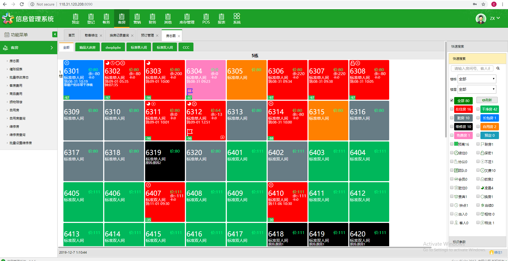
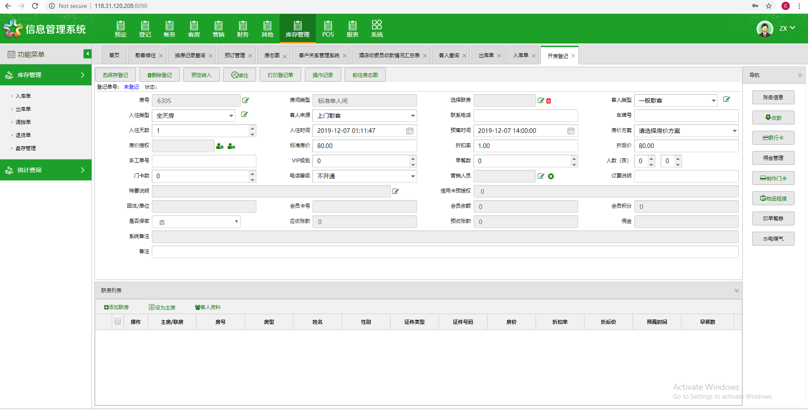

# Hotel Management System

## 系统介绍（Introduction)
This is HMS developed by ASP.NET.
This HMS can control multiple hotels at the same time.
HMS uses Redis for caching, MYSQL for database.

## 系统截图（System Screenshot)

## 系统结构（System Structure）

